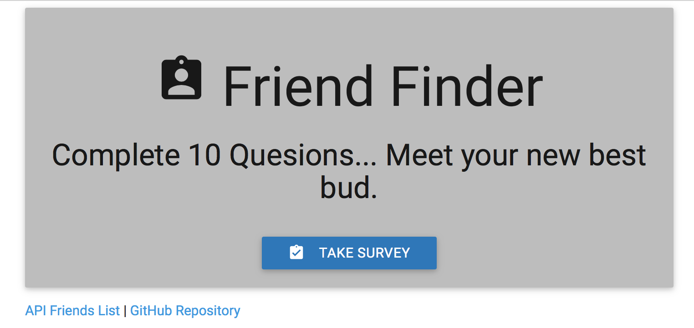
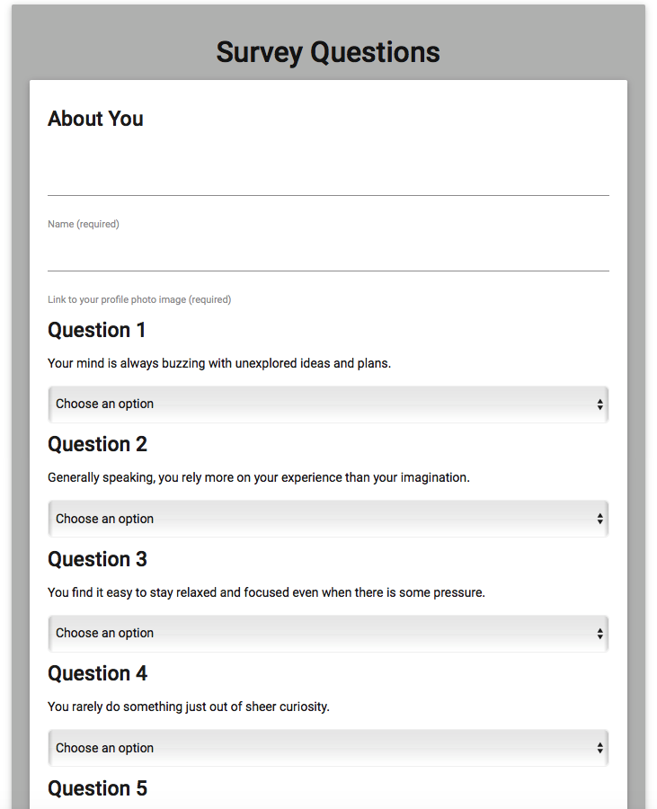

# FriendFinder

The goal of this project was to create a Friend Finder app (essentially a dating app but for friends) using Node and Express servers. Inside the app, the user is lead to a survey initally. When the user submits the survey, they are matched with a individual that has the closest calculated match to their personality based on the survey answers.

## Application Link
- https://friendfinder17.herokuapp.com

## Screen Shots
- Welcome Page

- Survey Page

## Technologies used
- Node.js
- [body-parager NPM Package](https://www.npmjs.com/package/inquirer)
- [express NPM Package](https://www.npmjs.com/package/express)
- [path NPM Package](https://www.npmjs.com/package/path)

### Prerequisites
- Node.js - [Download the latest version of Node](https://nodejs.org/en/)
- Materialize - [Link CDN in HTML](http://materializecss.com/getting-started.html)
